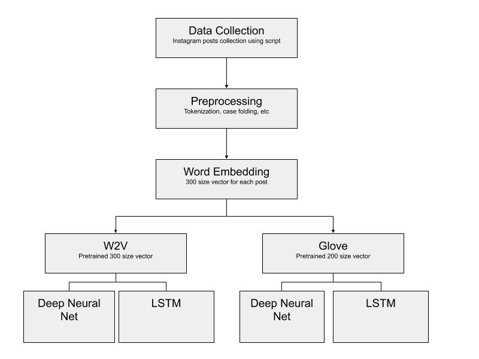

# Identification and analysis of Instagram posts involving Sexist Stereotyping.
## Major Course Project

<iframe width="560" height="315" src="https://www.youtube.com/embed/wN91O0Bvb7U" frameborder="0" allow="accelerometer; autoplay; encrypted-media; gyroscope; picture-in-picture" allowfullscreen></iframe>

### DATASET 

__Hashtags crawled__ : #everydaysexism, #genderbias, #genderstereotype, #heforshe, #mencallmethings, #metoo, #misogynist, #notallmen, #questionsformen, #slutgate, #wagegap, #weareequal, #womenareinferior, #workplaceharassment, #yesallwomen  
For each post 100 - 5000 posts were crawled with limitation on caption length set to 10 words.  
Posts crawled using above hashtags are labeled as positive data (accounts of sexism present). Random hashtags crawled and posts collected using them labeled as negative data(accounts of sexism absent).  

### DATA PRE-PROCESSING STEPS:
Following Data pre-processing steps are done.  
* Tokenised text using regex tokeniser.  
   * Regex used: [a-zA-Z0-9_#]+   
   * Removes text written in languages that do not use English alphabet like Hindi, Urdu, Arabic, Chinese, Japanese, etc.  
   * Removes punctuations other than _, # (Kept hashtags as it is)  
   * Removes emojis  
* Removed numbers from the text  
* Stopword removal  
* Lemmatisation  
* Removed words that are not present in English vocab  
* Case folding  

### DATA FILTERING:
Data is filtered using following criteria:  
* Separate restrictions on length of caption in a post and length of comments in a post. Here, length is the number of words present in pre-processed text.  
* Total no. of posts in final dataset : 7280   
* Ratio of positively labeled data to negatively labeled data is approximately one. To reduce irrelevant posts from positively labeled data, k-means clustering was performed with 2 clusters.   

### WORD EMBEDDINGS:
Multiple word embedding algorithms used to get vector representations for caption text. 
Word embedding of a post is calculated by taking the average of word embeddings of all the words in the post.  
Following word embedding algorithms are used:
* Word2Vec : pre-trained using google news corpus containing (3 billion running words) word vector model (3 million 300-dimension English word vectors).   
Vector size : 300  
* Glove : pre-trained on twitter dataset provided by Stanford.   
Vector size : 200  
All approaches tried after this are used on results of both w2v and glove embedding model.  

## BASELINE APPROACHES:
 From the above retrieved dataset, our Classification task falls into two types of
approaches:  
* Unsupervised Methods.  
* Supervised Methods.  

__UNSUPERVISED METHOD__:
Since the data is based on pre trained word embeddings and creating vector for every post, we could assume that each vector carries semantic meaning. We applied clustering approach to divide the dataset into 2 different clusters using K-Means clustering algorithm with intention to divide posts which carry similar semantic structure. Since dataset contains both positive and negative samples, it is assumed that they will be in different clusters. Results are discussed below.   
Purity of clusters observed in K-Means clustering algorithm : 52.5%

__SUPERVISED METHODS__:
    For supervised approaches, extracted posts with selected hashtags are given positive label and posts with dummy hashtags are given negative labels. After applying word embedding on combined data with 300 dimension vector for caption in each post, we tried the following approaches:  
* __Logistic Regression__: Applied standard Logistic Regression algorithm with 80 - 20 Split on train to test data.  
* __Naive Bayes__: Applied standard Naive bayes algorithm with 80 - 20 Split on train to test data.  
* __Random Forest__: Random Forest Ensemble implemented with 100 decision trees.  
* __SVM__: Applied Support vector machines with linear kernel and the regularization factor 1.  

### ARCHITECTURE

__DEEP NEURAL NETWORK and LSTM:__  
Following configuration is used for both deep neural network and LSTM models:  
* Input Layer : word embeddings of instagram post   
* Hidden Layer : Two hidden layers where number of neurons is equal to half of vector size of word embedding used at the input layer and “relu” activation function is used.  
* Output Layer : One neuron with “sigmoid” activation function. Threshold value 0.5 is used to label the post.  
“Random normal” kernel initializer and “binary cross-entropy” loss function is used  

* Hyper-Parameter tuning using cross-validation:  
For both Deep Neural Network and LSTM models, 3-fold cross validation is performed with training data only and below parameter values were varied :  
Size of batch (64, 128)  
No. of epochs (50, 100, 150)  
Type of optimizers (adam, rmsprop)  

__Cross-Validation results:__    
Best results observed with below parameter configuration:  
* Deep NN :  
  * Word2Vec : rmsprop optimizer, 128 batch size, 50 epochs.  
  * Glove: rmsprop optimizer, 128 batch size, 150 epochs.  
* LSTM :   
  * Word2Vec :  adam optimizer, 64 batch size, 150 epochs.   
  * Glove:   adam optimizer, 64 batch size, 100 epochs.  

### RESULTS:
Accuracy comparison of different models with different word-embeddings:   

|                  MOdel 	| Word Embedding 	| Accuracy 	|
|-----------------------:	|---------------:	|---------:	|
|            Naive Bayes 	|            W2V 	|    73.00 	|
|            Naive Bayes 	|          Glove 	|    77.00 	|
|    Logistic Regression 	|            W2V 	|    83.00 	|
| Logistic Regression    	| Glove          	| 81.00    	|
| Random Forest          	| W2V            	| 87.63    	|
| Random Forest          	| Glove          	| 87.50    	|
| Support Vector Machine 	| W2V            	| 83.00    	|
| Support Vector Machine 	| Glove          	| 80.00    	|
| Deep Neural Network    	| W2V            	| 85.93    	|
| Deep Neural Network    	| Glove          	| 86.19    	|
| LSTM                   	| W2V            	|  85.40   	|
| LSTM                   	| Glove          	|  85.76   	|

ANALYSIS:  Random Forest, Deep Neural Network and LSTM performs better among all the models implemented. Deep NN and LSTM model we implemented performs significantly better than all other baseline models tried. Also both word2vec and glove embedding gives similar results on each classification model with slight differences.
  

__GITHUB LINK__: https://github.com/karumugamio/IREProjectGroup12  
__WEBPAGE LINK__: https://vivek-2018201078.github.io/Sexism_classification/

